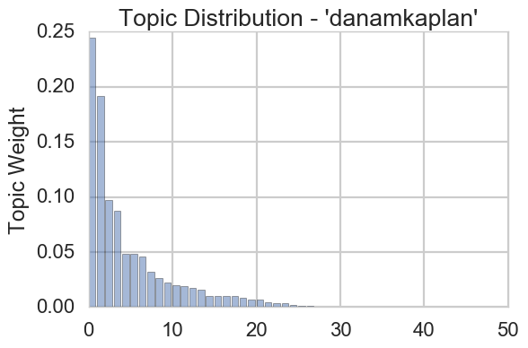

# The Missing Piece
A recommender system built with [BoardGameGeek's](https://www.boardgamegeek.com/) data. This project was built to solve a problem of two seemingly juxtaposed needs based on your BGG collection. I am trying to recommend a board game that:

* You will like, based on the features of your current collection.

* Also addresses needs you don't have covered (such as mechanics, themes, complexity, and player counts) so you have a "robust" collection.

### Idea:

From my interest and experience in the board game space, I know that people tend to conceptualize and discuss games in the language of features. E.g.
	
 * [Thunderstone](https://www.boardgamegeek.com/boardgame/53953/thunderstone) is a **deckbuilder** that has elements of **fantasy**, **hand management**, and **fighting**. 
 * There are a lot of popular **[worker placement](https://www.boardgamegeek.com/boardgamemechanic/2082/worker-placement)** games, but there is a strong connection between the themes of **farming** and **civilization building** to this mechanic.  

	

### Method:
Given my assumptions above, I decided to utilize topic modeling, specifically Non-Negative Matrix Factorization (NMF), to unearth the relationships between the game features. While it initially sounds like a clustering problem, there is a good amount of interplay between 'feature clusters'.

NMF was chosen because it can do 4 very important things in this project:

1. **Find latent features of the topics:**
	* NMF has very interpretable results. After finding an appropriate k (47 in this case), I could get the topic "weights" for both individual games and individual features. 
	* For example, you can see in the top 5 feature weights for Topic #18, there is a strong hinting at "Yahtzee" style games. 

  

| Weight of Feature to Topic | Feature | 
|--------------------|------------|
|0.9441 | 'Dice Rolling' |
|0.0230| 'Press Your Luck'|
|0.0095 |'Paper-and-Pencil'|
|0.0087| 'Betting/Wagering'|
|0.0039| 'Trading'|

2. **Create a topic distribution profile for a user's collection:**

3. **Cluster each game into the topic that has the heighest weight in it**
4. **This helps in calculating distances by reducing dimenions (in this case 135 to 47).**

### Recommendation Algorithm:
While [BGG's API](https://boardgamegeek.com/wiki/page/BGG_XML_API2) is fantastic at getting information for single games, they highly discourage iterating through user data. 

### Future Work:
 * Finish up the [recommender](./recommender.py) script to actually automate the  recommendation work (profiling a user, calculating the cosine distances, ranking games,etc...)
 * Replace the collection of json files as an actual DB, to help protect against future headaches. 
 * Make entire project into a Flask app
 	* Add a 'blacklist' type feature to exclude a mechanic or topic completely. E.g. I simply don't like to play or own heavy **negotiation** and **political** type games. Even if it is a topic I am weak in, I simply won't add those games to my collection. 
 * Address the model, and specifically adjust and add relevant features, as I test this recommender in the real world. 

